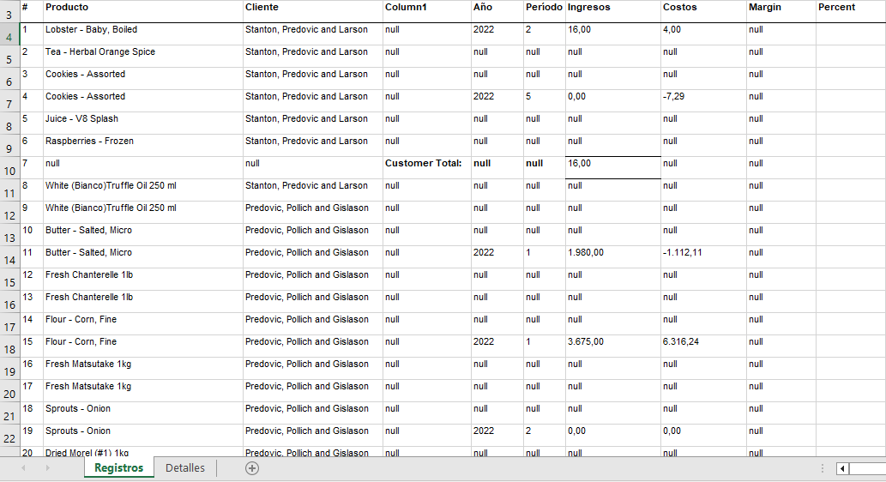
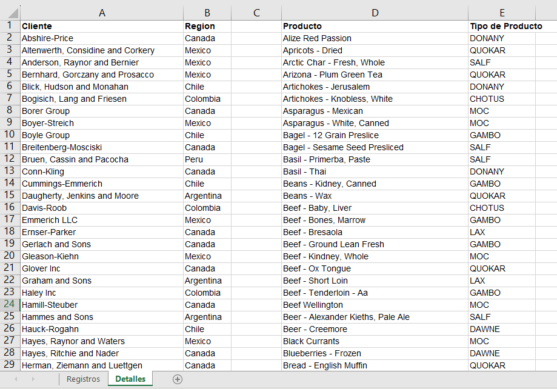
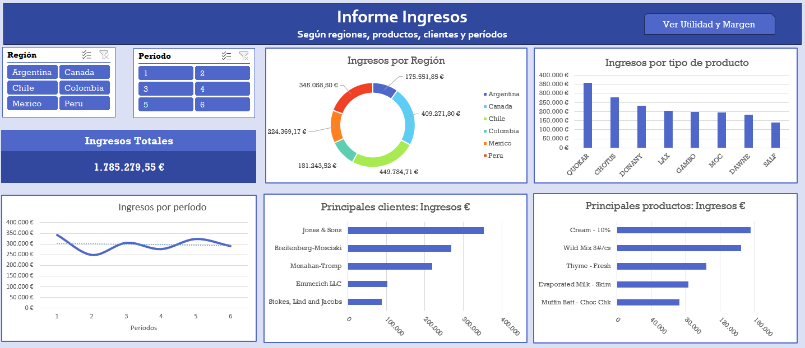
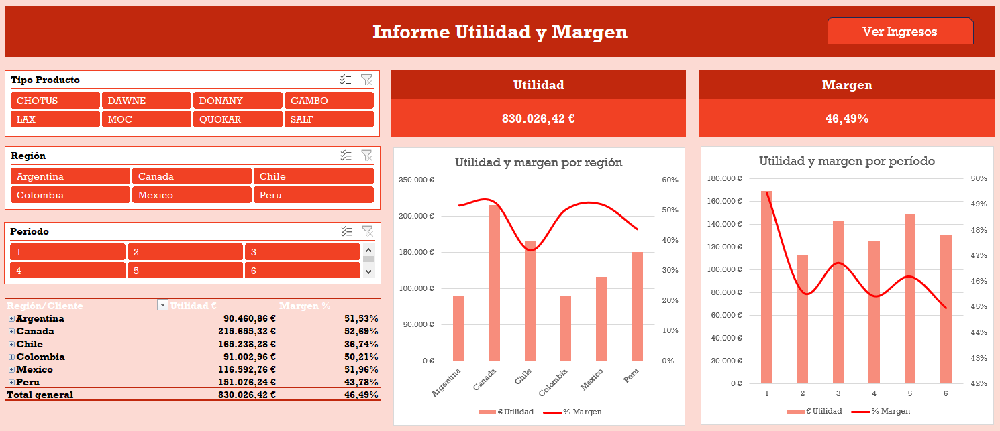

# Dashboard_Finanzas
Paneles de Control sobre Finanzas

## Introduction
Proyecto de una serie de prácticas realizadas con diferentes programas para la realización de Paneles de Control.

Actualmente esta realizado con Excel y Power BI.

[Excel](https://github.com/ntr94/Dashboard_Finanzas/blob/main/README.md#excel)

[Power BI](https://github.com/ntr94/Dashboard_Finanzas/blob/main/README.md#power-bi)

## Explicación
Este proyecto consiste en obtener un par de Paneles de Control con los datos de Finanzas disponibles. Estos datos cuenta con dos hojas diferentes con diferentes tablas. Estas tablas no estan en condiciones para hacer paneles, así que se ha realizado una preparación de los datos antes de la representación visual.

A partir de estos datos se van realizar dos paneles de control interactivo para la visualización de los datos mostrados. Estos paneles representarán un informe de Ingresos y otro informe de la Utilidad y el Margen.

[Archivo Excel Original](https://github.com/ntr94/Dashboard_Finanzas/blob/main/Finanzas_Original.xlsx)

## Excel

[Archivo Excel](https://github.com/ntr94/Dashboard_Finanzas/blob/main/Excel/Informe_Finanzas_Excel.xlsx)

## Power BI

[Archivo Power BI](https://github.com/ntr94/Dashboard_Finanzas/blob/main/Power%20BI/Informe_Finanzas_PowerBI.pbix)

## Dashboard relacionados

[Ventas](https://github.com/ntr94/Dashboard_Ventas)

[Producción](https://github.com/ntr94/Dashboard_Produccion)

